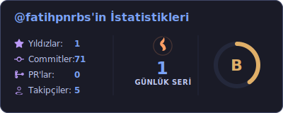

<h2 align="left">Hi 👋, I'm Fatih</h2>
<h4 align="left">I am a software student</h4>

- 🔗 I’m looking for help with **Web Development**

- 📫 How to reach me **fthpnrbsinfo@gmail.com**

- 💼 You can learn more about my experiences on [LinkedIn](https://www.linkedin.com/in/fatihpb/)

- 📝 You can find my notes on [Notion](https://fatihpnrbs.notion.site/plan-note)

- 🌅 When I'm sad, I like to watch the sunset.

- 🎧 Music is my soul.

<h3 align="left">I'm Currently Learning</h3>

  
  
  

<h3 align="left">Languages and Tools:</h3>

  
  
  
  
  
   
  
  
  

 

